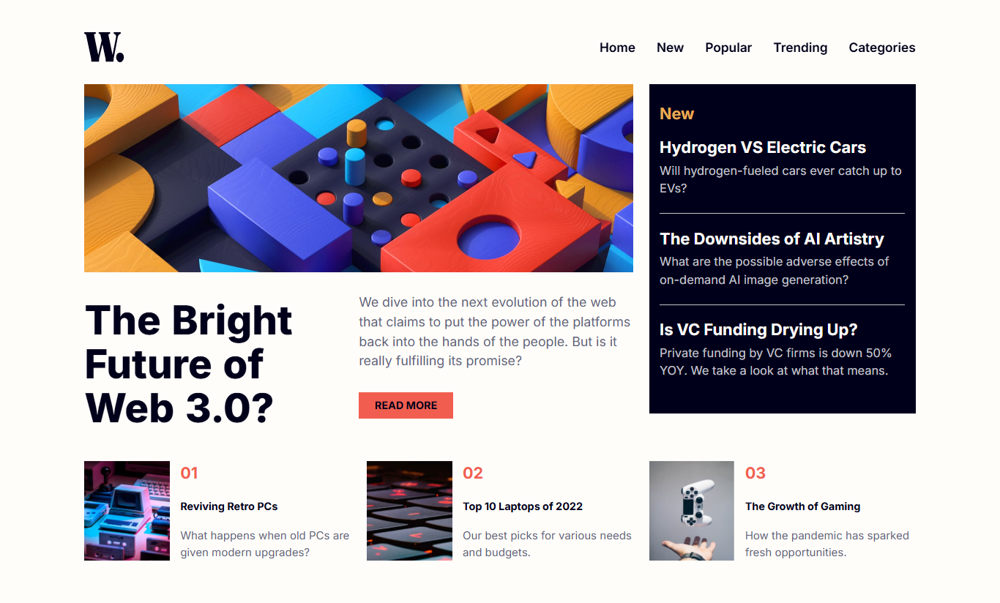
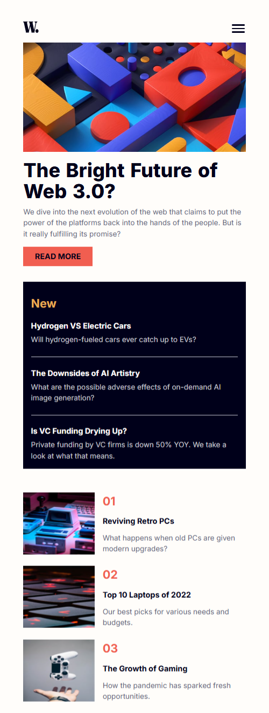

# Frontend Mentor - News homepage solution

This is a solution to the [News homepage challenge on Frontend Mentor](https://www.frontendmentor.io/challenges/news-homepage-H6SWTa1MFl). Frontend Mentor challenges help you improve your coding skills by building realistic projects. 

## Table of contents

- [Overview](#overview)
  - [The challenge](#the-challenge)
  - [Screenshot](#screenshot)
  - [Links](#links)
- [My process](#my-process)
  - [Built with](#built-with)
  - [What I learned](#what-i-learned)
  - [Continued development](#continued-development)
  - [Useful resources](#useful-resources)
  - [AI Collaboration](#ai-collaboration)
- [Author](#author)
- [Acknowledgments](#acknowledgments)

## Overview

### The challenge

Users should be able to:

- View the optimal layout for the interface depending on their device's screen size
- See hover and focus states for all interactive elements on the page

### Screenshot

### Links

- Solution URL: (https://github.com/jacey10/fm-news-homepage-challenge)
- Live Site URL: (https://jacey10.github.io/fm-news-homepage-challenge/)

## My process

### Built with

- Semantic HTML5 markup
- CSS custom properties
- Flexbox
- CSS Grid
- Mobile-first workflow

### What I learned

- I learned how to transform nav into an overlay (for mobile) and how to restore it back to normal for desktop.
- I applied grid-template-areas and subgrid for the first time. It was easy to implement and worked efficiently.

### Continued development

- I'd learn how to use React to build this project next time.

### AI Collaboration

- I used Claude and Qwen AI to debug overlay issues and stacking context issues.
- I also used them to brainstorm solutions.
- I basically got ideas from their suggestions which worked well for me. For intance, Claude suggested that to solve stacking context (backdrop covering overlay), I should remove give the backdrop a lower z-index but that didn't solve it because the header whuch contains the menu-overlay already has a lower z-index. So, I tried putting the backdrop div into the header. Now, it sits as a sibling next to the menu-overlay. So, giving the menu-overlay a higher z-index solved the stacking problem.

## Author

- Website - [Jacey Blog](https://www.jacey.hashnode.dev/)
- Frontend Mentor - [@jacey10](https://www.frontendmentor.io/profile/jacey10)
- Twitter - [@jacey_muna](https://x.com/jacey_muna)
